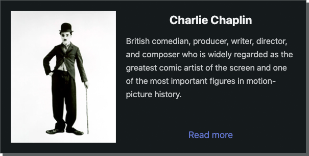

## NoCSS
+ __NoCSS__ is a CSS-in-JSX-lib, that enables developers to implement UI in a JSX/TSX-module without using CSS, SASS and BEM convention;
+ Unlike popular CSS-frameworks or CSS-libraries (e.g. _Teilwind_, _Ant Design_), __NoCSS__ does not provide ready-made components. Nevertheless, it offers a lightweight, flexible and powerful toolkit that helps us to build original UI more quickly and safely;
+ __NoCSS__ has built-in templates: _Button_, _Label_, _VStack_, _HStack_ etc, that can be customized programmatically;
+ Three elements are lying behind __NoCSS__: react _higher-order components_ (HOC), dynamic CSS rules and CSS selectors caching. __NoCSS__ does not generate Inline Styles;
+ __NoCSS__ is developed with respect for the values of _OOP_ and _Clean Code_.

## The 11 principles of NoCSS
0. Software module boundaries, its isolation and privacy have the highest priority;
1. Modularization and decomposition over number of files and size of files;
2. Each software module should have only one responsibility and only one reason to change (SRP);
3. One responsibility should be expressed in only one module;
4. Responsibilities should not overlap;
5. Code, logic, user and developer actions should not be duplicated;
6. Avoiding duplication should not lead to excessive complexity of the code, unjustified waste of resources or module isolation failure;
7. Readability of the high-level code should not be sacrificed for poorly designed tools;
8. Limitation of functionality over verbal agreement;
9. Mistakes should not be hidden, they must be detected as early as possible;
10. Mistakes should be fixed only at the place where they were caused.

## Disadvantages of Style Sheets
0. CSS does not have a monopoly on the representation of data. We often see UI logic leakage between CSS selectors, JS objects and JSX components.
1. CSS is not OOP friendly. CSS manipulates data structures, not objects. As a result, the isolation and security of modules is ignored. Changing the representation of one object may unexpectedly affect the representation of another.
2. If two modules are responsible for representing the same data, have similar or identical names, depend on each other or a common state, and when writing code we regularly switch between these modules, then we are actually dealing with one module that suffers from a split personality (split module). These modules can be a CSS rule and a JSX component, which actually perform the same task and share the same responsibility. Breaking module isolation like this or duplicating modules will make it harder to maintain old code and write new code.
3. Now we can declare variables and functions in CSS/SASS. These new possibilities demonstrate a trend in which CSS tries to mimic a programming language. This means actually duplicating JS functionality. In this case, Martin Fowler would say that CSS is jealous of JS.

## Disadvantages of CSS-in-JS approach
Direct interaction with CSS inevitably produces a lot of duplications and style conflicts.
Converting CSS rules into a JS object, as happens in [JSS library](https://cssinjs.org/), allows us to get rid of redundant CSS files.
However, styles declared in a JS object remain isolated from JSX components. Thus, the problem with the split module remains in JSS unresolved. In addition, declaring CSS properties in a JS object has a negative impact on readability.
Therefore, the main goal of NoCSS is to completely abandon CSS modules and CSS syntax by adding an abstract layer between CSS and JSX. When building a UI-component, we can now use only JSX syntax and only one module.

# Example


```ts
class Person {
  readonly name: string
  readonly description: string
  readonly photo: string
  readonly wikiLink: string

  constructor(name: string, description: string, photo: string, wikiLink: string) {
    this.name = name
    this.description = description
    this.photo = photo
    this.wikiLink = wikiLink
  }
}

const chaplin = new Person(
  'Charlie Chaplin',
  'British comedian, producer, writer, director ... in motion-picture history.',
  'chaplin.jpg',
  'https://en.wikipedia.org/wiki/Charlie_Chaplin')
```

```tsx
const App = () => {
  return (
    <PersonCard person={chaplin}/>
  )
}

interface CardProps {
  person: Person
}

const PersonCard = (props: CardProps) => {
  const person = props.person
  const theme = themeManager.theme

  return (
    <HStack width="600px" height='300px'
            padding='20px' gap="20px"
            borderColor={theme.text50}
            marginBottom='40px'
            shadow={'5px 5px 0 0 ' + theme.text50}>

      <Image src={person.photo}
             alt="Person photo"
             height='100%'/>

      <VStack width='100%' height='100%'
              halign='center'>
        <Label width='100%' textAlign='center'
               textColor={theme.white}
               text={person.name}
               fontWeight='bold'
               fontSize='1.25rem'/>

        <Label width='100%'
               textColor={theme.text + 'cc'}
               fontSize='0.9rem'
               text={person.description}/>

        <Spacer/>

        <LinkButton title='Read more'
                    link={person.wikiLink}
                    textColor='#6679d7'
                    hoverState={state => {
                      state.textDecoration = 'underline'
                    }}/>
      </VStack>
    </HStack>
  )
}

```
# To see more examples
```cli
git clone https://github.com/Dittner/react-nocss.git
```
```cli
cd PROJECT_FOLDER/react-nocss
npm install
npm run demo
```

# Install
```cli
npm i react-nocss
```

# License
MIT
